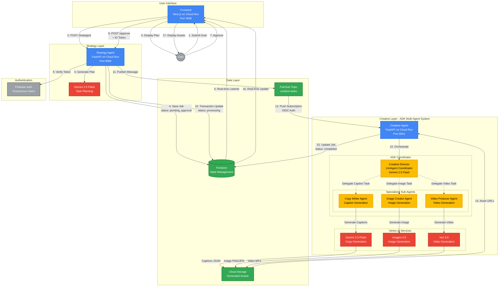

# Promote Autonomy - Architecture Diagram

## System Architecture Overview



## Key Components

### Cloud Run Services (3 Independent Services)
1. **Frontend** - Next.js web interface
2. **Strategy Agent** - Marketing plan generation with Gemini
3. **Creative Agent** - Asset generation with ADK multi-agent orchestration

### ADK Multi-Agent System
- **Creative Director**: LlmAgent coordinator orchestrating 3 specialized sub-agents
- **Copy Writer Agent**: Generates social media captions using Gemini
- **Image Creator Agent**: Generates promotional images using Imagen
- **Video Producer Agent**: Generates promotional videos using Veo

### Google Cloud Services
- **Firestore**: Job state management with real-time updates
- **Pub/Sub**: Asynchronous agent-to-agent communication
- **Cloud Storage**: Public asset hosting
- **Vertex AI**: Gemini, Imagen, Veo model access
- **Firebase Auth**: User authentication

## Human-in-the-Loop (HITL) Workflow

```
┌─────────────┐     ┌──────────────┐     ┌─────────────┐     ┌──────────────┐
│   Pending   │────▶│   Approval   │────▶│ Processing  │────▶│  Completed   │
│  Approval   │     │   Required   │     │ (Generating)│     │   (Assets)   │
└─────────────┘     └──────────────┘     └─────────────┘     └──────────────┘
      │                     │                                         │
      └─────────────────────┴─────────Rejected─────────────────────▶ ❌
```

## Data Flow (Step-by-Step)

1. **User Submission**: User enters marketing goal via Frontend UI
2. **Strategy Generation**: Strategy Agent calls Gemini to generate marketing plan
3. **Pending Approval**: Job saved to Firestore with `status = pending_approval`
4. **Real-time Display**: Frontend displays plan via Firestore listener
5. **Human Approval**: User reviews and approves the plan
6. **Atomic Transaction**: Strategy Agent updates Firestore + publishes to Pub/Sub atomically
7. **Pub/Sub Trigger**: Creative Agent receives message via push subscription (OIDC authenticated)
8. **ADK Orchestration**: Creative Director coordinator delegates tasks to 3 sub-agents in parallel:
   - Copy Writer → Gemini 2.5 Flash → Captions JSON
   - Image Creator → Imagen 4.0 → Image PNG/JPG
   - Video Producer → Veo 3.0 → Video MP4
9. **Asset Upload**: All generated assets uploaded to Cloud Storage with public URLs
10. **Completion**: Creative Agent updates Firestore to `status = completed` with asset URLs
11. **Display Results**: Frontend shows generated assets to user

## Security Features

- **Firebase Authentication**: Anonymous user authentication
- **Firestore Security Rules**: Read-only client access, server-side writes only
- **OIDC Authentication**: Pub/Sub push subscription validates tokens
- **Service Accounts**: Minimal IAM permissions per service
- **ID Token Verification**: Strategy Agent validates Firebase tokens on approval

## Scalability Features

- **Serverless Architecture**: All services auto-scale on Cloud Run
- **Async Processing**: Pub/Sub decouples strategy and creative agents
- **Parallel Execution**: ADK orchestrates 3 agents in parallel for efficiency
- **Timeout Protection**: 120s for Gemini, 90s for Imagen, 120s for Veo
- **Idempotent Design**: Safe duplicate message handling

## Technology Stack

- **Frontend**: Next.js 14, React, TypeScript, Firebase SDK
- **Backend**: FastAPI, Python 3.11+, Google ADK, Pydantic
- **AI Models**: Gemini 2.5 Flash, Imagen 4.0, Veo 3.0
- **Infrastructure**: Cloud Run, Firestore, Pub/Sub, Cloud Storage
- **Orchestration**: Google Agent Development Kit (ADK)
- **Testing**: pytest (83 tests), GitHub Actions CI/CD
